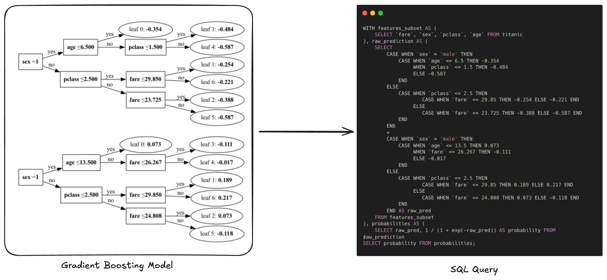

## sqlgbm

sqlgbm is a Python library that converts tree-based machine learning models into SQL queries.
This allows you to deploy your ML models directly in your database without any additional infrastructure.



### Installation

```bash
pip install sqlgbm
```

## Usage

sqlgbm currently supports LightGBM models and can convert them to SQL queries:

```python
from sqlgbm import SQLGBM
import lightgbm as lgb
import pandas as pd

# Load titanic dataset
titanic = pd.read_csv('titanic.csv')
features = ['pclass', 'sex', 'age', 'fare']
X = titanic[features]
X['sex'] = X['sex'].astype('category')
y = titanic['survived']

# Train model
clf = lgb.LGBMClassifier(n_estimators=3, max_depth=3)
clf.fit(X, y, categorical_feature=['sex'])

# Convert to SQL
sqlgbm = SQLGBM(clf, cat_features=['sex'])
sql = sqlgbm.generate_query('titanic', 'probability')

print(sql)
```

### Output Types

sqlgbm supports different output formats:

- `raw`: Returns the raw model output
- `probability`: Returns the probability (after sigmoid transformation)
- `prediction`: Returns the binary prediction (0 or 1) based on a 0.5 threshold
- `all`: Returns all three outputs

### License

MIT